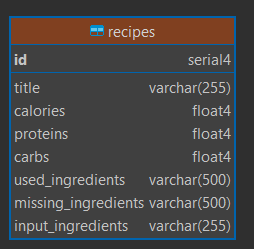
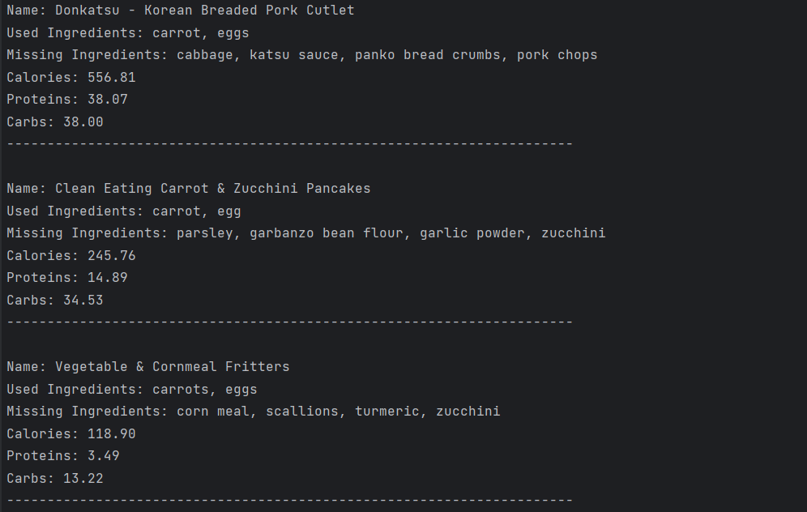

# recipe-finder

## Table of contents

- [Introduction](#introduction)
- [Launching](#launching)
- [Project structure](#project-structure)
- [API and database](#api-and-database)
- [Usage example](#usage-example)


## Introduction
This project helps users to generate list of meals based on their fridge contents with minimal number of missing 
ingredients needed.

## Launching
In main folder execute command o build program: `make build`

Then run program with your flags:

    --ingredients - comma-separated list of ingredients from your fridge
    --numberOfRecipes - the maximum number if recipes you want

Example run: `./recipeFinder --ingredients=carrots,eggs --numberOfRecipes=4`

If you want more details about program and its running: `./recipeFinder -h`.

## Project structure

```
recipeFinder
|   README.md
|   Makefile
|   go.mod
|   go.sum
|
|___cmd
|    |___commandlineArguments
|    |   |___root.go
|    |
|    |___recipeFinder
|        |___main.go
|
|___intenal
    |___api
    |   |___api.go
    |
    |___database
    |    |___database.go
    |
    |___recipe
        |___recipeService.go
```


## API and database
I used API https://spoonacular.com/food-api and two endpoints:

    https://api.spoonacular.com/recipes/findByIngredients

    https://api.spoonacular.com/recipes/{id}/information

I used PostgreSQL database running on Docker container. Database contains only one table `recipes`:



## Usage example

User runs program with proper flags. 

Program checks if recipes with same input ingredients list are already in database. 

If yes - user receives records from database.

If not - programs sends requests to API and saves recipes to database for future use.

As an output he received formatted list of recipes including their names, used ingredients, missing ingredients, 
calories, proteins and carbs.

Example:

`./recipeFinder --ingredients=carrots,egg --numberOfRecipes=3`

Output:



